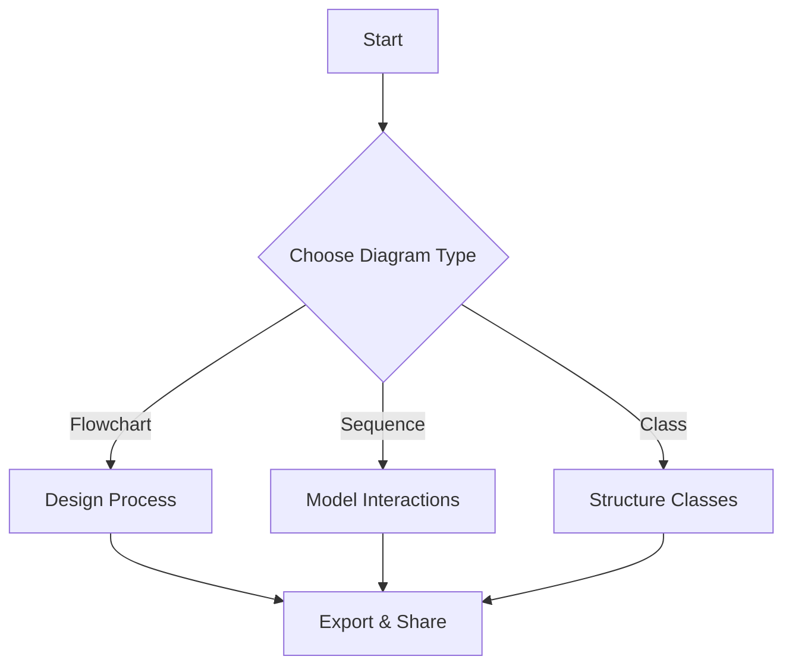

# 🚀 Mermaide - Professional Diagram Editor

> **World-class Mermaid.js diagram editor** with Monaco Editor, advanced features, and a stunning modern UI.

[](https://your-demo-url.com)
[](LICENSE)
[](https://mermaid.js.org/)

---

## ✨ Features

### 🎨 **Professional UI/UX**
- **Modern Glassmorphism Design** - Beautiful, professional interface with smooth animations
- **Monaco Editor** - VS Code's powerful editor with syntax highlighting, minimap, and autocomplete
- **Resizable Split Panes** - Drag to resize editor and preview panels
- **Dark/Light Mode** - Seamless theme switching with automatic Mermaid theme sync
- **Responsive Design** - Works flawlessly on desktop, tablet, and mobile
- **Toast Notifications** - Elegant, non-intrusive feedback system

### 📊 **All Mermaid Diagram Types** (15+)
- ✅ **Flowchart** - Process flows and decision trees
- ✅ **Sequence Diagram** - Interaction timelines
- ✅ **Class Diagram** - OOP structure visualization
- ✅ **State Diagram** - State machine modeling
- ✅ **ER Diagram** - Database relationships
- ✅ **Gantt Chart** - Project timelines
- ✅ **User Journey** - UX flow mapping
- ✅ **Pie Chart** - Data proportions
- ✅ **Git Graph** - Version control branches
- ✅ **Mind Map** - Hierarchical brainstorming
- ✅ **Timeline** - Chronological events
- ✅ **Quadrant Chart** - Priority matrix
- ✅ **Requirement Diagram** - System requirements
- ✅ **Sankey Diagram** - Flow visualization
- ✅ **XY Chart** - Line and bar graphs

### 🎯 **Advanced Editor Features**
- **Monaco Editor Integration** - Industry-leading code editor
- **Syntax Highlighting** - Clear, readable code
- **Line Numbers & Minimap** - Easy navigation for large diagrams
- **Code Formatting** - Auto-format with `Alt+Shift+F`
- **Live Rendering** - Real-time preview as you type
- **Adjustable Render Delay** - Customize debounce timing (100ms - 2000ms)
- **Auto-Save** - Never lose your work (localStorage)
- **Template Gallery** - 15+ pre-built templates with search
- **Status Bar** - Line/column tracking and render time

### 🔧 **Powerful Tools**
- **Zoom Controls** - Zoom in/out/reset (30% - 300%)
- **Mousewheel Zoom** - `Ctrl + Scroll` for quick zooming
- **Center View** - Instantly center your diagram
- **Fullscreen Mode** - Distraction-free editing and previewing
- **Split Panel Resizer** - Customize your workspace layout

### 💾 **Export & Sharing**
- **PNG Export** - High-quality raster images (1× to 10× scale)
- **SVG Export** - Vector graphics for scalability
- **PDF Export** - (Coming soon)
- **Copy to Clipboard** - Quick code copying
- **Share URL** - Generate shareable links with embedded diagrams
- **Auto-scale PNG** - Intelligent size calculation for optimal quality

### ⌨️ **Keyboard Shortcuts**
| Shortcut | Action |
|----------|--------|
| `Ctrl + Enter` | Render diagram |
| `Ctrl + B` | Toggle sidebar |
| `Ctrl + Shift + T` | Toggle theme |
| `Alt + Shift + F` | Format code |
| `Ctrl + ,` | Open settings |
| `Ctrl + /` | Show shortcuts |
| `Ctrl + Shift + E` | Export PNG |
| `Ctrl + Shift + C` | Copy to clipboard |
| `Ctrl + +/-` | Zoom in/out |
| `Ctrl + 0` | Reset zoom |
| `F11` | Fullscreen editor |

### ⚙️ **Settings & Customization**
- **Auto-Save Toggle** - Enable/disable automatic saving
- **Live Rendering Toggle** - Enable/disable real-time preview
- **Render Delay** - Adjust debounce timing
- **Default Export Scale** - Set preferred PNG resolution
- **Clear Storage** - Reset all saved data

### 🎨 **Template Gallery**
Organized categories with search functionality:
- **Basic Diagrams** - Flowchart, Sequence, Class, State, ER
- **Planning & Management** - Gantt, Journey, Timeline, Requirement
- **Data Visualization** - Pie, Quadrant, XY, Sankey
- **Specialized** - Git Graph, Mind Map

---

## 🚀 Quick Start

### Option 1: Direct Use
Simply open `index.html` in your browser - **no installation required!**

### Option 2: Clone & Run
```bash
git clone https://github.com/your-username/mermaide.git
cd mermaide
# Open index.html in your browser
```

### Option 3: Deploy
Host on any static site platform:
- GitHub Pages
- Netlify
- Vercel
- Cloudflare Pages

---

## 📖 Usage Guide

### Basic Workflow
1. **Select a Template** - Click the sidebar icon or press `Ctrl+B`
2. **Edit Code** - Use the Monaco editor with full autocomplete support
3. **Live Preview** - Watch your diagram render in real-time
4. **Customize** - Zoom, pan, and adjust the view
5. **Export** - Download as PNG, SVG, or share via URL

### Creating Diagrams


### Sharing Diagrams
Click **Share** button to generate a URL with your diagram embedded:
```
https://your-domain.com/mermaide/?diagram=base64encodedcontent
```

---

## 🛠️ Technologies

| Technology | Purpose |
|-----------|---------|
| **Mermaid.js v10** | Diagram rendering engine |
| **Monaco Editor** | VS Code's editor component |
| **Font Awesome 6** | Professional icon library |
| **Inter Font** | Modern, clean typography |
| **HTML5 + CSS3 + Vanilla JS** | No framework dependencies |

---

## 🎨 Design Philosophy

### Modern & Professional
- Glassmorphism effects with backdrop blur
- Smooth animations and transitions
- Carefully crafted color palette
- Consistent spacing and typography

### User-Friendly
- Intuitive keyboard shortcuts
- Contextual toast notifications
- Clear visual feedback
- Progressive enhancement

### Performance-Optimized
- Debounced rendering for efficiency
- Optimized re-renders
- Minimal dependencies
- Fast load times

---

## 🌐 Browser Support

| Browser | Support |
|---------|---------|
| Chrome/Edge | ✅ Full support |
| Firefox | ✅ Full support |
| Safari | ✅ Full support |
| Opera | ✅ Full support |

**Minimum Requirements:**
- ES6+ JavaScript support
- CSS Grid & Flexbox
- LocalStorage API
- Canvas API

---

## 📱 Responsive Design

Mermaide adapts beautifully to all screen sizes:
- **Desktop** (1920px+): Full split-pane experience
- **Laptop** (1366px+): Optimized two-column layout
- **Tablet** (768px+): Stacked vertical panels
- **Mobile** (320px+): Single-column mobile-first design

---

## 🔒 Privacy & Security

- **100% Client-Side** - No data sent to servers
- **LocalStorage Only** - Your diagrams stay on your device
- **No Analytics** - Zero tracking or telemetry
- **Open Source** - Fully transparent code

---

## 🚧 Roadmap

### Coming Soon
- [ ] PDF export with custom layouts
- [ ] Diagram versioning and history
- [ ] Import from file (.mmd, .txt)
- [ ] Multiple diagram tabs
- [ ] Custom theme builder
- [ ] Collaborative editing (real-time)
- [ ] Diagram templates marketplace
- [ ] JPEG/WebP export
- [ ] Print optimization
- [ ] Mermaid syntax autocomplete

### Future Enhancements
- [ ] Diagram diff viewer
- [ ] AI-powered diagram generation
- [ ] Cloud sync (optional)
- [ ] Plugins system
- [ ] Command palette (Ctrl+K)
- [ ] Vim/Emacs keybindings
- [ ] Multi-language support

---

## 🤝 Contributing

Contributions are welcome! Here's how you can help:

1. **Fork** the repository
2. **Create** a feature branch (`git checkout -b feature/amazing-feature`)
3. **Commit** your changes (`git commit -m 'Add amazing feature'`)
4. **Push** to the branch (`git push origin feature/amazing-feature`)
5. **Open** a Pull Request

### Development Guidelines
- Follow existing code style
- Test on multiple browsers
- Update documentation
- Add comments for complex logic

---

## 📄 License

This project is licensed under the **MIT License** - see the [LICENSE](LICENSE) file for details.

---

## 🙌 Acknowledgements

- [Mermaid.js](https://mermaid.js.org/) - Incredible diagram rendering library
- [Monaco Editor](https://microsoft.github.io/monaco-editor/) - World-class code editor
- [Font Awesome](https://fontawesome.com/) - Beautiful icon library
- [Inter Font](https://rsms.me/inter/) - Modern typeface

---

## 💬 Support

- **Issues**: [GitHub Issues](https://github.com/your-username/mermaide/issues)
- **Discussions**: [GitHub Discussions](https://github.com/your-username/mermaide/discussions)
- **Email**: your-email@example.com

---

## ⭐ Show Your Support

If you find Mermaide useful, please consider:
- ⭐ Starring the repository
- 🐦 Sharing on Twitter
- 📝 Writing a blog post
- 🎥 Creating a tutorial

---

<div align="center">

**Made with ❤️ by developers, for developers**

[View Demo](https://your-demo-url.com) · [Report Bug](https://github.com/your-username/mermaide/issues) · [Request Feature](https://github.com/your-username/mermaide/issues)

</div>
